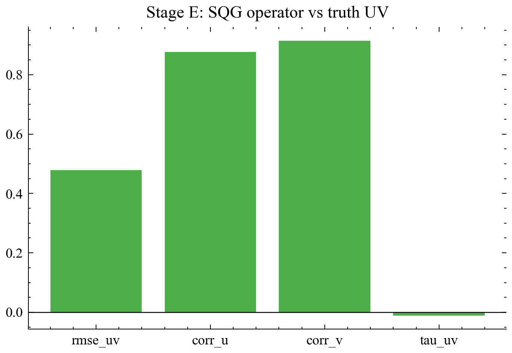
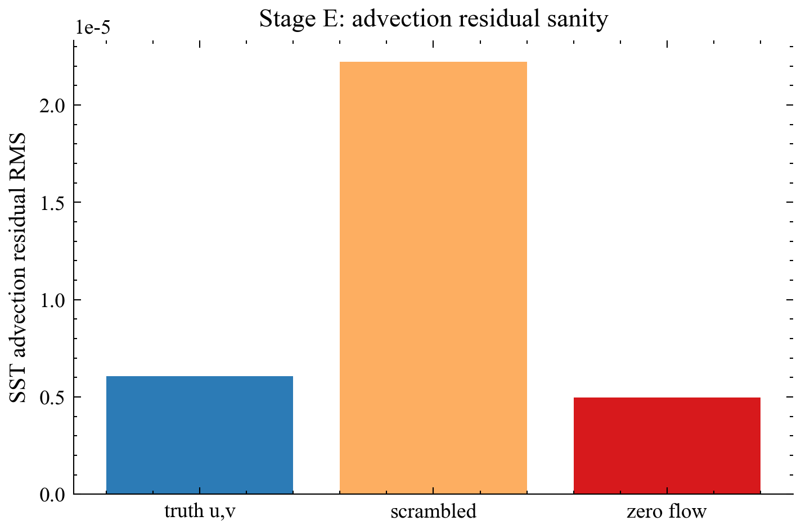
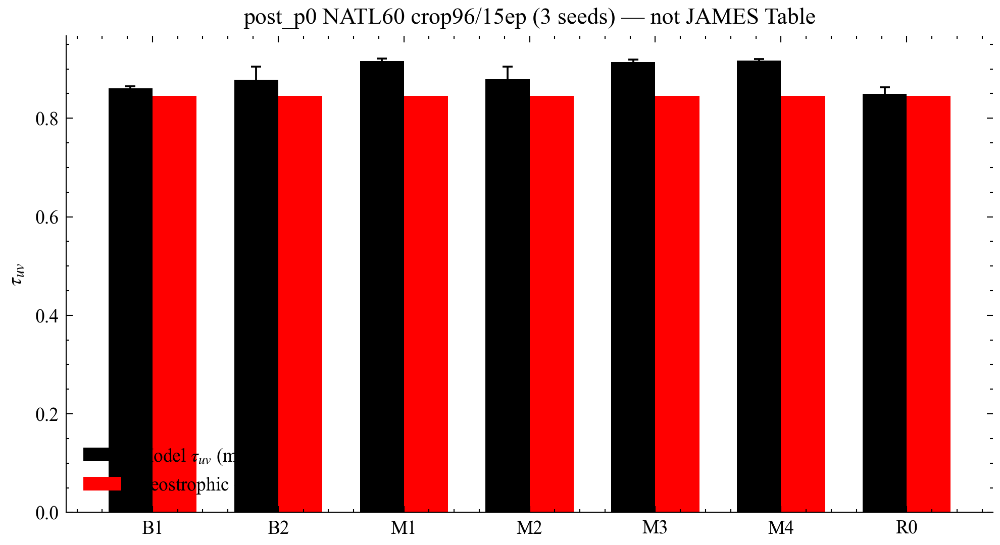
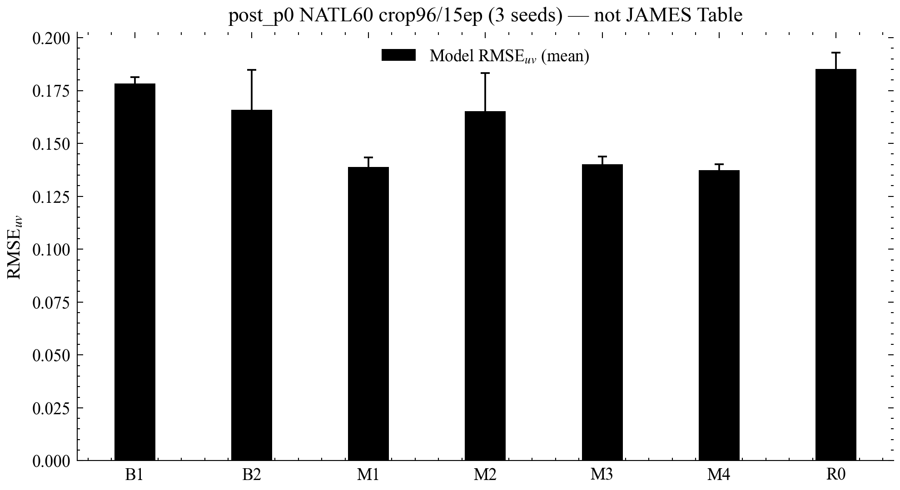
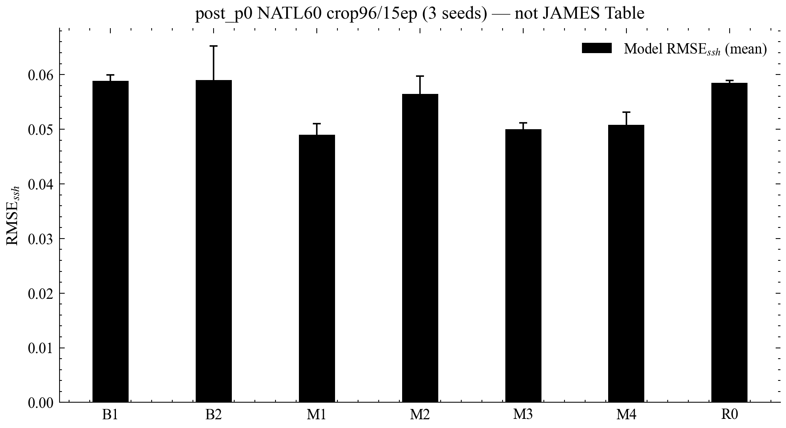

# 基于 SST–SSH 协同与软物理残差的 4DVarNet 海表流场反演研究报告

日期：2026-09-15  
代码：https://github.com/Coucou2016/4DVarNets-sea-current

> 主证据：post_p0 crop96/15ep×3seeds + Stage E。非正式 JAMES 全场 Table。

## 1. 摘要

（见 HTML 版完整叙述。）在 post_p0 协议上，软 SQG 配置（M1/M3/M4）平均 τ_uv 高于 B2；Stage E 显示单独 SQG τ_uv≈0。全场长训 Table：待补充。数字均来自本仓库 JSON。

## 2. 背景与目标

见 HTML。关键文献 DOI：Fablet 2024 `10.1029/2023MS003609`；Beauchamp 2023 `10.5194/gmd-16-2119-2023`；VarDyn 2025 `10.1029/2024MS004689`；Lapeyre & Klein 2006 `10.1175/JPO2840.1`。

## 3. 数据与方法

紧凑 4DVarNet-inspired + 软 SQG/平流/应变重加权。细节：`docs/paper/02_methods.md`。

## 4. 研究过程

见 HTML 路径列表。审计：`docs/AUDIT_EVIDENCE.md`。

## 5. 结果

### post_p0 主表

| 配置 | τ_uv ↑ | rmse_uv ↓ | rmse_ssh ↓ |
|------|--------|-----------|------------|
| B1 | 0.861±0.004 | 0.178±0.003 | 0.059±0.001 |
| B2 | 0.878±0.027 | 0.166±0.019 | 0.059±0.006 |
| M1 | 0.916±0.005 | 0.139±0.004 | 0.049±0.002 |
| M2 | 0.880±0.025 | 0.165±0.018 | 0.056±0.003 |
| M3 | 0.914±0.005 | 0.140±0.004 | 0.050±0.001 |
| M4 | 0.917±0.003 | 0.137±0.003 | 0.051±0.002 |
| R0 | 0.850±0.013 | 0.185±0.008 | 0.059±0.000 |
| geo | 0.846 | — | — |

### 图件

### 图1. Stage E：eSQG 风格算子相对真值 UV 的技能诊断

<strong>读图：</strong>展示 SQG 算子相对 NATL60 真值流速的相关、RMSE 与解释方差等诊断（见同目录 JSON）。

<strong>物理含义：</strong>表面准地转（SQG / eSQG）试图用海表温度/浮力异常推断流函数；本仓库实现为<strong>有效</strong> eSQG 风格混合，而非完整三维 SQG 反演。

<strong>结论：</strong>相关可较高，但 τ_uv 均值接近 0（甚至略负）。因此把 SQG 当作“单独给出正确流速”会失败；更合理的是在学习型变分代价里作<strong>软约束</strong>。

### 图2. Stage E：SST 平流残差真值 / 扰乱 / 零流对照

<strong>读图：</strong>比较真值流速、扰乱流速与零流速下的平流–扩散残差 RMS。

<strong>方程角色：</strong>残差 r=∂tT + u·∇T − κ∇²T 衡量温度变化是否与流速平流一致。

<strong>结论：</strong>真值残差系统性低于扰乱场（算子对流速敏感）；零流残差有时可不高于真值，说明日尺度上 ∂t−κ∇² 可占主导——平流项单独增益可能有限。

### 图3. post_p0 消融：表面流解释方差 τ_uv（三随机种子均值±标准差）

<strong>读图：</strong>横轴 B1/B2/M1–M4/R0；纵轴 τ_uv（explained variance of surface currents，相对气候学方差的解释比例，越高越好）。误差棒为多种子标准差；地转为 OI-only 基线。

<strong>协议：</strong>NATL60 paper-mode，crop96，15 epoch，batch1，seeds {0,1,2}。

<strong>结论：</strong>含软 SQG 的 M1/M3/M4 均值高于纯 SST–SSH 的 B2；B2 高于 B1 与地转。这与 Stage E“硬 SQG 无效”并不矛盾——软残差在展开求解器内起正则化作用。

<strong>边界：</strong>≠ JAMES 全场 Table；正式 Table 待补充。

### 图4. post_p0 消融：RMSE_uv（均值±标准差）

<strong>读图：</strong>RMSE_uv 越低越好，与 τ_uv 互补（绝对误差 vs 方差解释）。

<strong>结论：</strong>排序与图3大体一致：M1/M3/M4 误差更低。请同时查看多种子离散度，避免单一种子过度解读。

### 图5. post_p0 消融：RMSE_ssh（均值±标准差）

<strong>读图：</strong>海表高度重建误差。物理残差主要面向流速，但仍可能通过耦合改变 SSH 技能。

<strong>结论：</strong>本协议上 M1/M3/M4 的 SSH RMSE 亦不劣于 B2，未见历史 raw-NLL 尺度失控导致的 SSH 崩塌。

### 图6. 隔离区 legacy GPU96（crop96/20ep，pre_p0_fix）τ_uv

<strong>读图：</strong>历史 B2/M3/M4 与地转对照。该阶段地转诊断曾异常（大幅负 τ_uv），且排序为 B2&gt;M3≳M4。

<strong>用途：</strong>仅说明 P0 修正前的工程史与协议依赖性；<strong>不作</strong>当前科学主结论。

### 图7. 合成 OSSE 短训（8 epoch）τ_uv——方向性通路检查

<strong>读图：</strong>合成数据上的快速消融，用于验证损失与物理项代码通路。

<strong>边界：</strong>统计结构简化，不得外推为 NATL60 正式排序。

## 6–8. 讨论 / 结论 / 局限

见 HTML。正式 Table 与 OSE：待补充。
