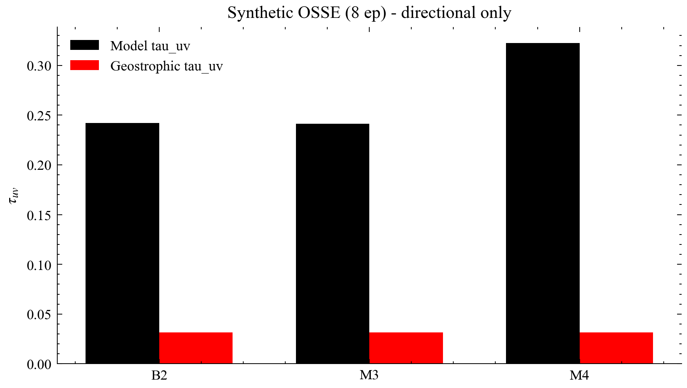
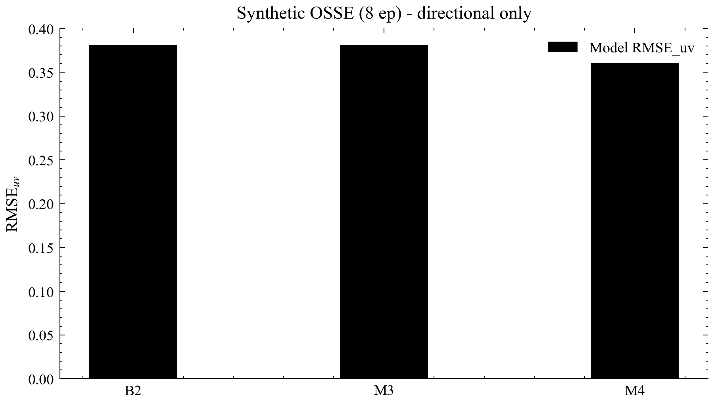
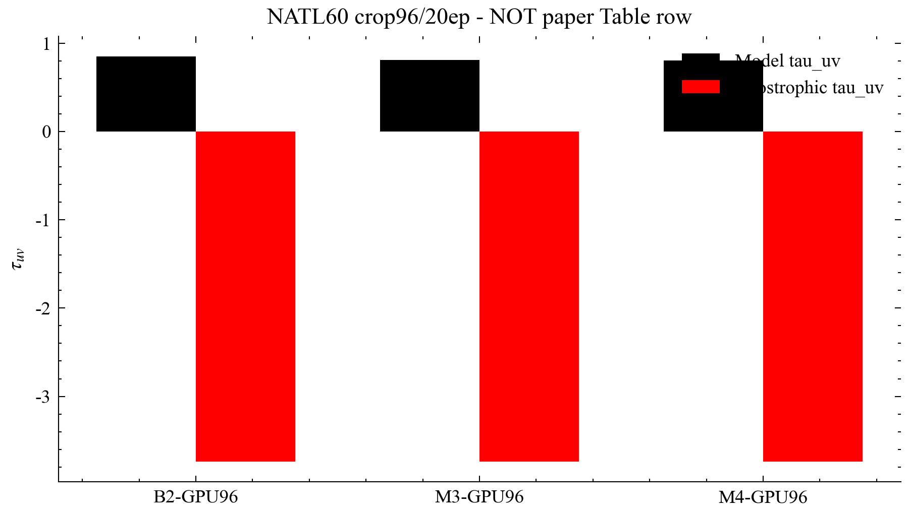
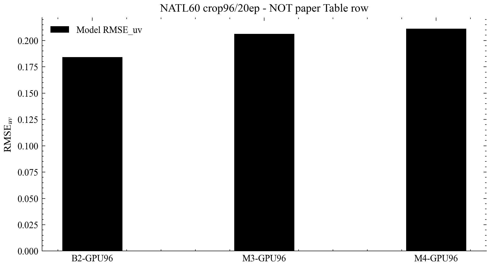
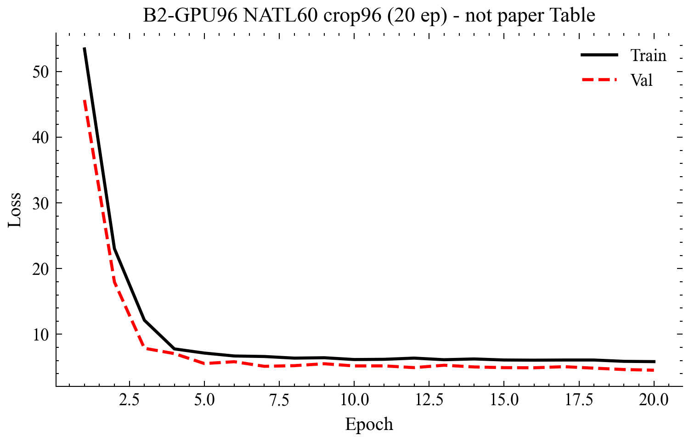
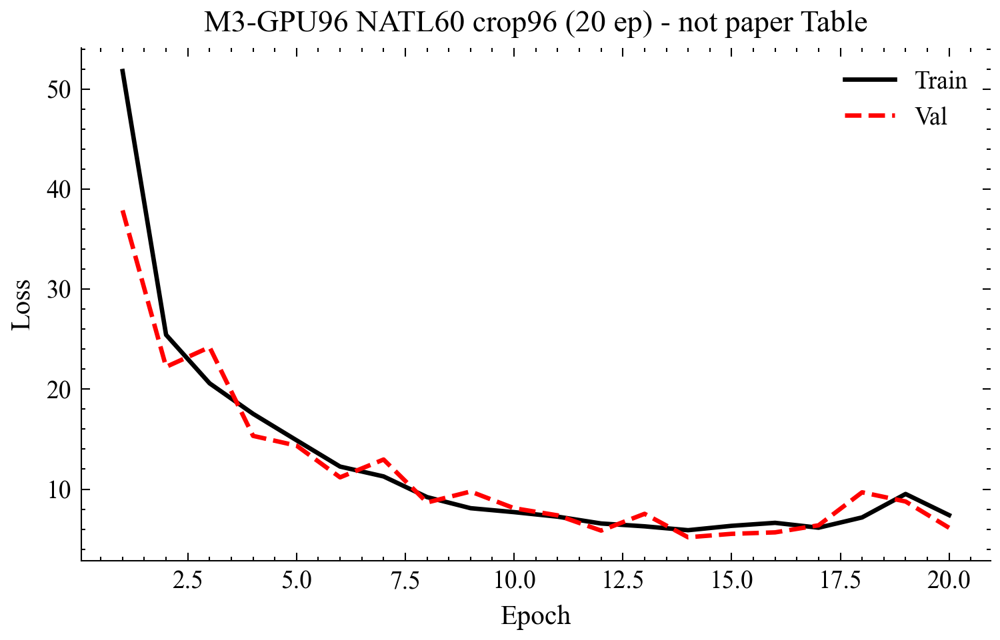
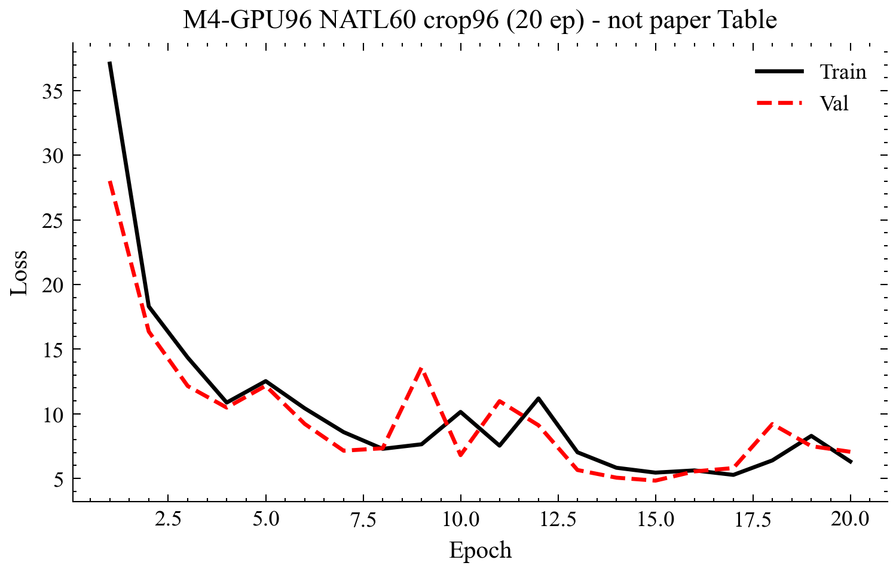
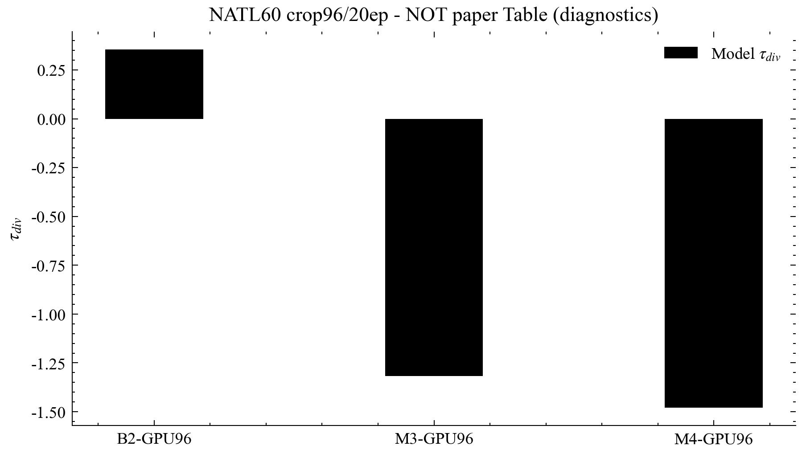
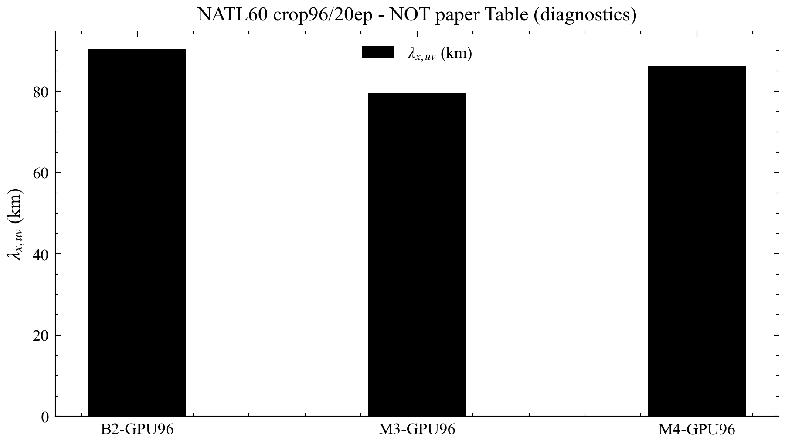

# 基于 SST–SSH 协同与物理残差的 4DVarNet 海表流场反演研究报告

**日期：** 2026-08-16  
**证据级别：** 合成短训（方向性）+ NATL60 GPU96 crop96/20ep（初步）· **非正式论文 Table**  
**基线：** Fablet et al. (2024), JAMES, https://doi.org/10.1029/2023MS003609

---

## 目录

1. 摘要
2. 研究背景与目标
3. 数据与方法
4. 研究过程
5. 结果
6. 分析与讨论
7. 结论
8. 局限与展望

---

## 1. 摘要

海表流场（SSC）反演受 SSH 分辨率与地转近似限制。本工作在 Fablet 风格 4DVarNet 求解器上嵌入 eSQG 风格 SQG 残差、SST 平流残差与可选应变 UV 不确定性。NATL60 **crop96/20ep** 实测：**B2 > M3 ≳ M4**（τ_uv 0.848 / 0.811 / 0.801），均优于地转（τ_uv ≈ −3.74）。M4 经 NLL 尺度修正后 SSH RMSE 恢复至约 0.063。物理项可实现且相对地转有增益，但在本协议上并非普遍优于纯 SST–SSH 协同。

---

## 2. 研究背景与目标

详见仓库 `docs/paper/01_introduction.md`。目标：可开关物理残差、公平消融、诚实部分结果、自包含报告。

**术语：** OSSE / OSE / τ_uv / λ_x / B2·M3·M4 — 见 HTML 版首次展开。

---

## 3. 数据与方法

- 合成 OSSE + NATL60 crop96/20ep（全场长训：待补充）
- 代价函数与 σ 归一化 NLL：见 `docs/paper/02_methods.md`
- 作图：SciencePlots + Times New Roman + CJK 回退（SimSun / Microsoft YaHei）

---

## 4. 研究过程

实现 → 合成验证 → GPU96 消融 → M4 NLL 修复重训 → 扩展诊断表/图 → 出图与报告。公开仓库 https://github.com/Coucou2016/4DVarNets-sea-current ；ChatGPT 浏览器 MCP / Codex 配额受阻（见 SESSION_5ROUNDS.md），DOI 由 WebSearch 核验；粘贴简报见 docs/chatgpt_collaboration/。

---

## 5. 结果

### 表1. NATL60 GPU96

| 配置 | τ_uv ↑ | rmse_uv ↓ | rmse_ssh ↓ | τ_div | λ_x,uv (km) |
|------|--------|-----------|------------|-------|-------------|
| B2 | 0.848 | 0.184 | 0.059 | 0.354 | 90.3 |
| M3 | 0.811 | 0.206 | 0.064 | -1.317 | 79.6 |
| M4 post-NLL-fix | 0.801 | 0.211 | 0.063 | -1.480 | 86.1 |
| M4 pre-fix | 0.806 | 0.209 | 0.122 | -2.844 | 91.1 |
| geo | -3.740 | 1.029 | 0.059 | 0.000 | 101.6 |

> 注：NATL60 crop96/20ep，≠ JAMES paper table。全场 200ep / B1 本会话未跑（4GB GPU）。

### 表2. 合成 OSSE

见 `results/metrics_{B2,M3,M4}.json`（方向性）。

### 图件

### 图1. 合成 OSSE 消融：表面流场解释方差 τ_uv

<strong>读图方式：</strong>横轴为消融配置 B2 / M3 / M4；纵轴为 τ_uv（explained variance of surface currents，表面流速解释方差，越接近 1 表示相对气候学方差的可解释比例越高）。每组给出模型与地转基线对照。

<strong>背景与目的：</strong>合成数据用于在无 NATL60 长训前验证物理残差与不确定性项的代码通路与损失量级是否合理。

<strong>结论：</strong>在短训合成协议下，M4（含应变相关不确定性）在三配置中 τ_uv 最高，表明该设置下物理项/不确定性项可带来方向性收益；地转基线明显更弱。本图<strong>不能</strong>直接外推到裁剪 NATL60 GPU96 排名。

### 图2. 合成 OSSE 消融：表面流场均方根误差 RMSE_uv

<strong>读图方式：</strong>纵轴为 RMSE_uv（u、v 分量均方根误差的综合指标，越低越好）。

<strong>含义：</strong>与图1互补——τ_uv 强调方差解释，RMSE 强调绝对误差幅值。合成短训中 M4 误差最低，与 τ_uv 排序一致。

<strong>注意：</strong>合成场统计结构简化，仅作工程与方向性证据。

### 图3. NATL60 GPU96（crop96/20ep）τ_uv：B2 / M3 / M4 对比地转

<strong>读图方式：</strong>对比 B2-GPU96、M3-GPU96、M4-GPU96 的模型 τ_uv 与地转 τ_uv。地转 τ_uv 为大幅负值（约 −3.74），表示相对气候学方差，地转重建在该裁剪协议下解释能力很差。

<strong>核心结论（实测）：</strong>排序为 <strong>B2 &gt; M3 ≳ M4</strong>，三者均远优于地转。显式加入 eSQG 风格 SQG 残差与 SST 平流残差（M3）以及应变不确定性（M4，NLL 修正后重训）并未在本协议上超过纯 SST–SSH 协同（B2）。

<strong>严格边界：</strong>crop96 + 20 epoch ≠ JAMES 论文全场 Table；不得据此宣称“物理项普遍提升技能”。

### 图4. NATL60 GPU96（crop96/20ep）RMSE_uv

<strong>读图方式：</strong>RMSE_uv 越低越好。B2 最低（约 0.184），M3（约 0.206）与 M4（约 0.211）接近且均远低于地转（约 1.029）。

<strong>与 τ_uv 一致：</strong>支持“学习型 4DVarNet 相对地转有大幅增益，但物理附加项在本短裁剪协议上非单调增益”。

### 图5. B2-GPU96 训练/验证损失曲线

<strong>读图方式：</strong>横轴 epoch，纵轴为训练损失与验证损失。B2 为 SSH+SST 多模态基线（无 SQG/平流/不确定性）。

<strong>含义：</strong>验证损失在约 4.5 量级收敛（最佳约 4.53），表明多模态观测项与先验项尺度匹配正常，可作为 M3/M4 损失尺度的参照。

### 图6. M3-GPU96 训练/验证损失曲线

<strong>读图方式：</strong>M3 在 B2 基础上打开 SQG 与 SST 平流残差（λ_sqg、λ_adv）。

<strong>观察：</strong>最佳验证损失约 5.19，略高于 B2，与最终 τ_uv 略低于 B2 的结果相一致，提示固定权重物理残差可能过约束短训轨迹，或算子在裁剪窗口内存在偏差。

### 图7. M4-GPU96（NLL 尺度修正后重训）训练/验证损失曲线

<strong>读图方式：</strong>M4 在 M3 上增加应变相关 UV 不确定性监督项。修正前 raw NLL 曾使最佳验证损失膨胀至约 682、SSH RMSE 恶化；本图为 σ 归一化 NLL + MSE 混合后的 20 epoch 重训结果。

<strong>结论：</strong>最佳验证损失约 4.83（约第 15 epoch），SSH 误差恢复至约 0.063；流场技能仍略低于 B2。说明损失尺度工程修复有效，但物理/不确定性项仍未在本协议上超越 SST 协同。

### 图8. NATL60 GPU96（crop96/20ep）τ_div 诊断

<strong>读图方式：</strong>纵轴为散度场解释方差 τ_div（explained variance of divergence）。正值表示相对气候学方差有正解释能力；负值表示该诊断上弱于气候学基线。

<strong>背景与目的：</strong>主表 τ_uv 之外，补充动力学结构诊断，检验物理残差是否改善散度一致性。

<strong>结论：</strong>在本裁剪短训协议上仅 B2 为正（约 0.35），M3/M4 为负。这加强“物理项并非普遍加分”的部分结果叙事，仍<strong>≠</strong>论文正式 Table。

### 图9. NATL60 GPU96（crop96/20ep）λ_x,uv 诊断

<strong>读图方式：</strong>纵轴为表面流速分辨尺度 λ_x,uv（km，error/signal PSD 比阈值阈值相关定义）。数值来自同一评测 JSON。

<strong>结论：</strong>报告实测尺度诊断以充实证据面；因 crop96/20ep，不得把 λ_x 宣称为 JAMES Table 分辨尺度结论。

---

## 6. 分析与讨论

B2 领先支持“学习协同可能已覆盖部分 SQG/平流可迁移信息”；合成与 NATL60 排名差支持体制依赖。M4 SSH 问题主要为损失尺度。文献 DOI：Fablet 2024；Beauchamp 2023 GMD；Lapeyre & Klein 2006；Rio 2016；Martin 2023；VarDyn 2024MS004689。

---

## 7. 结论

1. 物理残差可嵌入并消融；2. crop96/20ep 上 B2>M3≳M4 且均胜地转；3. M4 NLL 修复有效；4. 正式 Table / OSE 待补充。

---

## 8. 局限与展望

裁剪偏差、多种子与 λ 扫描缺失、全场长训与 OSE/B1 未完成；公开 GitHub 已推送；ChatGPT 自动化顾问通道本会话受阻（人工粘贴简报可继续）。

---

*由 `scripts/build_report.py` 生成。数值真源：`results/metrics_*.json`。*
